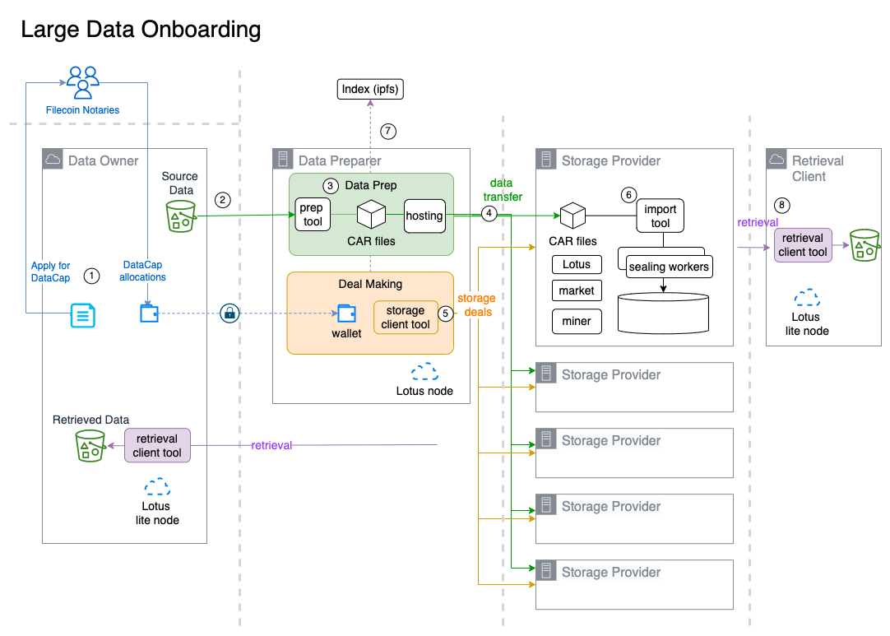

# 📤 Data onboarding pipeline

### Data flow design

This guide prescribes the following pipeline design:&#x20;

<figure><figcaption></figcaption></figure>

#### General Sequence

1. Data Owner applies for DataCap and upon approval by Notaries, DataCap is allocated in tranches.
2. Data Preparer uses ... TODO continue...

###

### 1. Data Transfer to Data Preparer.

The original dataset may be optionally pre-processed by the Data Owner, e.g. encryption, to form the Source Data. The Source Data is then transferred to the Data Preparer.&#x20;

1-time online data transfer to a Data Preparer can reduce data transfer costs for the Data Owner, particularly if public cloud data egress fees apply. Other things to evaluate:

* hybrid cloud connectivity from public cloud to on-premises, if applicable.
* optimal connectivity from Source Data to Data Preparer, e.g. co-location, if feasible.&#x20;
* offline data transfer options, where available.

The Data Preparer is responsible for packaging the source data into the Filecoin CAR format, and staging the CAR files for distribution to the other participating SPs who will store replicas. The Data Preparer hosts the CAR files that participating SPs will fetch upon receipt of the online data transfer deal. Alternatively the SP will fetch&#x20;

### 2. Data Preparation

###

### 3. Transfer to Online Data Transfer, Online Deals

Determine the usable network bandwidth to a specific miner endpoint. Evaluate data transfer optimization such as aria2, HTTP protocol compression, etc. Calculate the estimate online data transfer time for the full dataset.

### 2. Offline Data Transfer, Online Deals.

### Data Transfer options.

Data transfer can take place online, or offline (out-of-band).&#x20;

Online data transfers should generally use pull-mode into the SP

Out-of-band (aka. "offline")

TODO needs work... where to place this?
