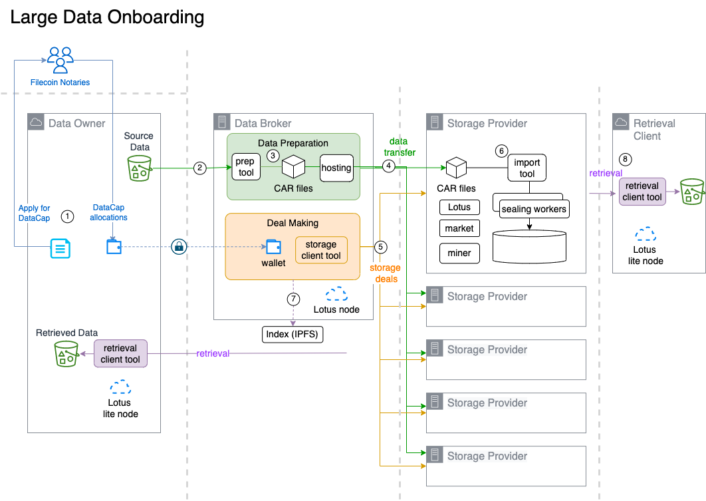

# 📐 Reference Architecture

### Data flow design

The following is the prescribed data pipeline design to onboard large data sets.&#x20;

<figure><figcaption>
Data Broker Reference Architecture
</figcaption></figure>

####

An outline of data onboarding steps are as follows:

1. Apply for Datacap
2. Fetch source dataset for data preparation.
3. Prepare source dataset into the **C**ontent-addressable **AR**chive ("CAR") format
4. Transfer CAR files to Storage Providers
5. Propose storage deals to SPs.
6. Each SP imports CAR files for storage deals and seals the data
7. Create an index for each dataset.
8. Test retrievals&#x20;

#### Data Broker

The "Data Broker" role is responsible for data preparation, coordination with participating SPs, and to make storage deals with SPs. The Data Broker can recommend participating SPs that meet the data owner's requirements. The Data Broker functions as a trusted agent of the data owner.&#x20;

The Data Broker role can be performed by either of:

* the _Lead Storage Provider,_\
  __The onboarding experience is managed by an experienced and skilled Lead SP. The Lead SP becomes a trusted delegate of the Data Owner.
* the _Data Owner_,\
  When the data owner organization wants to take control of the onboarding process, and have the required technical skills and resources.
* an _independent_ _service provider_\
  __The Data Broker can potentially become a services business for vendors and systems integrators.

###
