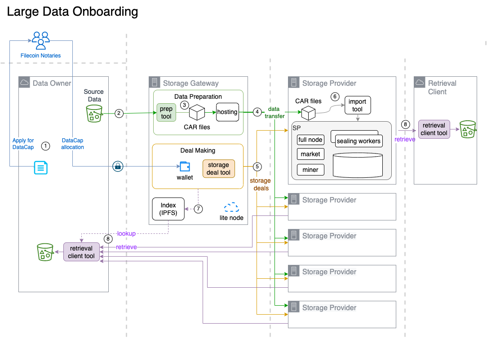

# 📤 Reference Architecture

### Data flow design

This guide prescribes the following data pipeline design.&#x20;

<figure><figcaption>
Data Broker Reference Architecture
</figcaption></figure>

#### Data Broker

This document proposes the term "Data Broker" as the role responsible for Data Preparation, coordination with participating SPs, and Deal Making to said SPs.&#x20;

The Data Broker functions as a trusted agent of the Data Owner. The Data Broker role can be performed by any of:

* the Data Client itself,
* a lead Storage Provider (this is currently typical), &#x20;
* an independent Data Broker service provider,&#x20;
* split roles across multiple Data Preparers, and a Deal Making engine, such as [Filecoin Slingshot](https://slingshot.filecoin.io/).   &#x20;

Once the preceding steps are cleared, i.e.: DataCap tranche allocated, Storage Providers selected, Data Preparer selected, then the following steps are:

### 2. Data Transfer to Data Preparer.

The original dataset may be optionally pre-processed by the Data Owner, e.g. encryption, to form the Source Data. The Source Data can then be transferred to the Data Preparer using any online protocol or offline transport.

1-time online data transfer to a Data Preparer can reduce data transfer costs for the Data Owner, particularly if public cloud data egress fees apply. Other things to evaluate:

* hybrid cloud connectivity from public cloud to on-premises, if applicable.
* optimal connectivity from Source Data to Data Preparer, e.g. co-location, if feasible.&#x20;
* offline data transfer options, where available.

The Data Preparer is responsible for packaging the source data into the Filecoin CAR format, and staging the CAR files for distribution to the other participating SPs who will store replicas. The Data Preparer hosts the CAR files that participating SPs will fetch upon receipt of the online data transfer deal. Alternatively the SP will fetch&#x20;

### 3. Data Preparation

###

### 4. Distribute data to SPs

Determine the usable network bandwidth to a specific miner endpoint. Evaluate data transfer optimization such as aria2, HTTP protocol compression, etc. Calculate the estimate online data transfer time for the full dataset.

### 5. Propose Storage Deals

###
